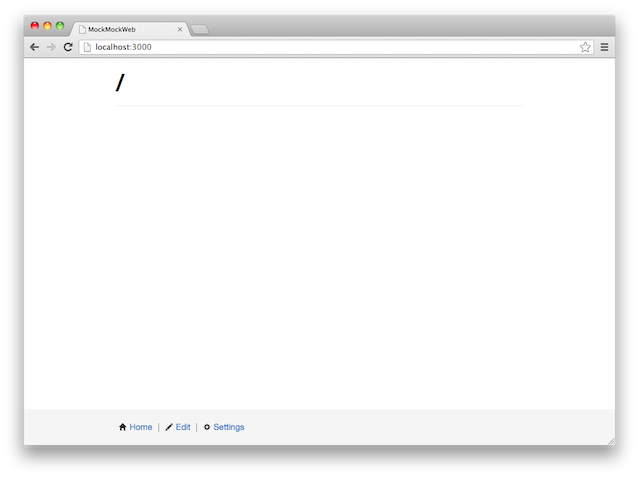
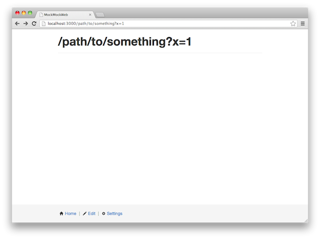
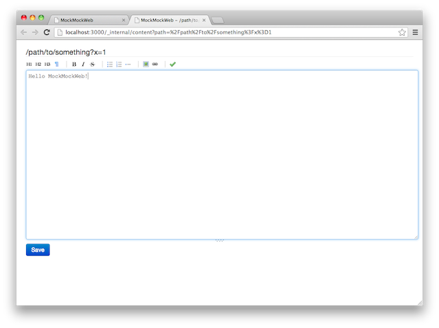
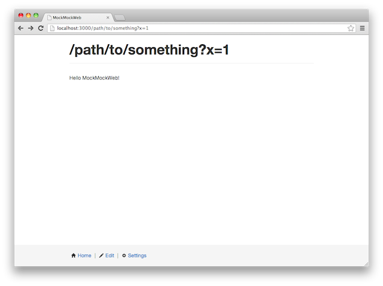

MockMockWeb
===========

MockMockWeb is a [Heroku](https://www.heroku.com/)-ready [Node.js](http://nodejs.org/)-based web application server that allows you to:

* instantly launch a website that sends an empty page (with status 200) to any request/URL
* edit any page on the spot
* edit the layout shared throughout your website
* use the website as if it was real
* get full control of the content and structure

MockMockWeb lets you build a mock (sometimes real) website in a request-driven interaction, very intuitive and easy to use (almost no learning curve).

Getting Started
----------------

1) Install [Node.js](http://nodejs.org/)

2) Get MockMockWeb

    $ git clone https://github.com/ubicast/MockMockWeb.git

3) Run the MockMockWeb server

    $ node server.js

4) Bring up a web browser and go to http://localhost:3000

5) Edit the empty website as you want

(*) The site data will be stored in the memory by default.

Deploying to Heroku
-------------------

You can customize the options by editing the Procfile, which is used by Heroku to launch the app server. By default, the site data will be stored in the MongoDB (if you provision one of the MongoDB add-ons).

For more details, see: https://devcenter.heroku.com/articles/nodejs

